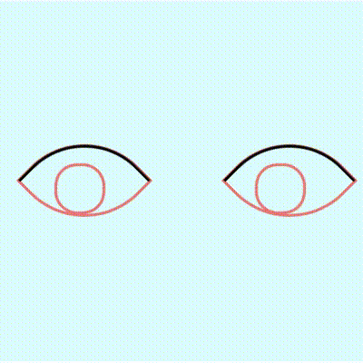

# INTERACTIVE EYES TO EXISTING HTML PAGE
this script will create an eye, that tracks mouse movement. The eye can also be
supplementer with an moving eyelid.

# How To Use

## Embeding to .HTML
1. Prepare `HTML` structure:
```html
<div id="wrapper" class="close">
   <div class="edges">
      <div class="eyelid"></div>
      <div class="close_lid" style="transform: rotate(-45deg);">
            <div id="eye">
               <div id="pupil"></div>
            </div>
      </div>
   </div>
</div>
```
2. Import `eye.js` as module to your HTML
3. Craete new instance of `Eye` object and `.start()`
```html
<script type="module">
   import Eye from "./eye.js";
   
   const eye = new Eye(document.getElementById("eye"), 25, document.getElementById("pupil"), document.getElementById("wrapper"));
</script>
```
   - Options
   `new Eye(border, eyelid, pupil, container = false, debuging = false)`
      - `border` - HTML element node
      - `eyelid` - circle in `px`. Its size is 100% of movement of the pupil
      - `pupil`- HTML element node (mostly circle via `border-radius`) with `position: relative`
      - `container` - not mandatory parameter. HTML element node, which drives movement of the `<div class="eyelid"></div>` via `class="close"` and `class="open"`
      - `debbuging` - if set `true`, a solid border will appear on `border` HTML element to help determine of whats hapening

## Demo
